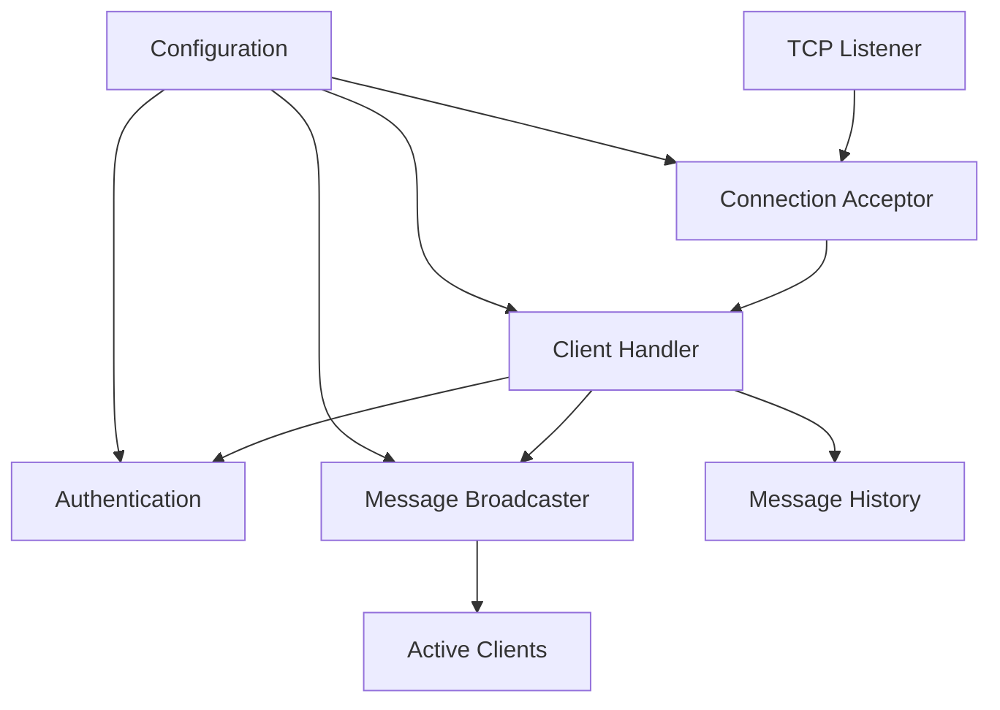
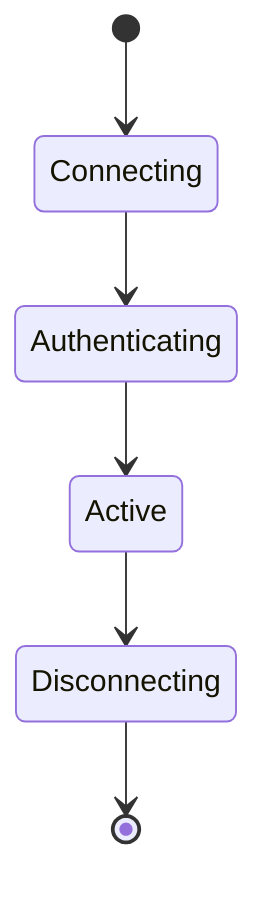

# Net-Cat: High-Performance TCP Chat Server

A production-grade TCP chat server implementation in Go featuring concurrent client handling, robust error management, and configurable runtime behavior.

## Architecture Overview



### Core Components

- **Connection Manager**: Handles TCP connections with configurable limits
- **Protocol Layer**: Implements message formatting and state management
- **Broadcast System**: Ensures reliable message delivery to all clients
- **Authentication Service**: Manages user sessions and name validation
- **Configuration System**: Provides runtime-configurable server parameters

## Installation

### Prerequisites

- Go 1.19 or higher
- Linux/macOS/Windows supported
- Network port access (default: 8989)

### Build from Source

```bash
# Clone repository
git clone https://github.com/yourusername/net-cat.git
cd net-cat

# Build binary
go build -o TCPChat cmd/main.go

# Run tests
go test ./...
```

## Configuration

### Server Parameters

```go
type Config struct {
    ListenAddr       string        // Network address to listen on
    MaxClients      int           // Maximum concurrent clients (default: 10)
    ClientTimeout   time.Duration // Client inactivity timeout (default: 5m)
    MessageRateLimit time.Duration // Message rate limiting (default: 1s)
    MaxMessageSize  int           // Maximum message size (default: 1024)
    MaxNameLength   int           // Maximum username length (default: 32)
    MaxNameChanges  int           // Maximum name changes allowed (default: 3)
    LogFile        string        // Log file location
}
```

### Environment Variables

| Variable | Description | Default |
|----------|-------------|---------|
| PORT | Server listening port | 8989 |
| MAX_CLIENTS | Maximum concurrent connections | 10 |
| LOG_FILE | Server log file path | server.log |

## Usage

### Starting the Server

```bash
# Default configuration (port 8989)
./TCPChat

# Custom port
./TCPChat 2525
```

### Client Connection

Connect using netcat or any TCP client:

```bash
nc localhost 8989
```

## Protocol Specification

### Message Format

```
[TIMESTAMP][SENDER][RECIPIENT]: MESSAGE
```

- TIMESTAMP: RFC3339 format (e.g., "2024-01-24 15:04:05")
- SENDER: Client username or "SYSTEM"
- RECIPIENT: Target username or broadcast
- MESSAGE: UTF-8 encoded text (max 1024 bytes)

### System Messages

```
[2024-01-24 15:04:05][SYSTEM]: User {username} has joined
[2024-01-24 15:04:05][SYSTEM]: User {username} has left
[2024-01-24 15:04:05][SYSTEM]: Server shutting down...
```

## Security Considerations

1. **Input Validation**
   - Username sanitization
   - Message size limits
   - Rate limiting per client

2. **Resource Protection**
   - Maximum connection limits
   - Automatic timeout for inactive clients
   - Memory usage constraints

3. **Error Handling**
   - Graceful connection termination
   - Resource cleanup on disconnection
   - Panic recovery in goroutines

## Performance Optimization

- Concurrent client handling with goroutines
- Efficient broadcast message delivery
- Connection pooling and timeout management
- Memory-efficient message history

## System Design

### Data Models

```go
// Client represents a connected chat participant
type Client struct {
    Conn        net.Conn
    state       protocol.ConnectionState
    name        string
    nameHistory []string
    activity    time.Time
}

// Message represents a chat message
type Message struct {
    From      string
    Content   string
    Timestamp time.Time
}
```

### State Management



## Error Handling

### Common Error Scenarios

| Error Type | Handling Strategy | Recovery Action |
|------------|------------------|-----------------|
| Connection Lost | Automatic cleanup | Remove client, broadcast departure |
| Invalid Message | Drop message | Send error notification |
| Rate Limit | Block temporarily | Wait for rate limit window |
| Server Full | Reject connection | Send capacity message |

## Testing

### Unit Tests

```bash
# Run all tests
go test ./...

# Run with race detection
go test -race ./...

# Run with coverage
go test -cover ./...
```

### Integration Tests

Located in `cmd/main_test.go`, covering:
- Connection handling
- Message broadcasting
- Client authentication
- Error scenarios

## Contributing

1. Fork the repository
2. Create a feature branch
3. Commit changes
4. Submit pull request

### Code Style

- Follow Go best practices
- Use gofmt for formatting
- Add tests for new features
- Update documentation

## Monitoring and Diagnostics

### Logging Standards

- Timestamp
- Log level
- Component
- Message
- Contextual data

### Metrics

- Active connections
- Message throughput
- Error rates
- System resource usage

## FAQ

### Connection Issues

Q: Why can't I connect to the server?
A: Check if:
1. Server is running
2. Port is available
3. Firewall allows connection
4. Maximum clients not reached

### Performance

Q: What's the maximum recommended number of concurrent clients?
A: Default is 10, but can be increased based on available system resources.

## Dependencies

- Standard Go library only (no external dependencies)
- Go 1.19+ required for bug fixes and performance improvements

## License

MIT License. See LICENSE file for details.
