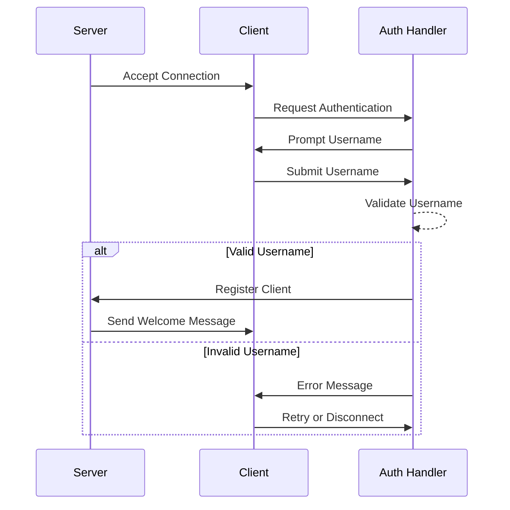

# Client Package Documentation

The client package manages individual client connections, handling authentication, message sending/receiving, and state management for each connected user in the TCP chat server.

## Core Components

### Client Structure

```go
type Client struct {
    Conn        net.Conn               // TCP connection
    state       protocol.ConnectionState // Current connection state
    name        string                 // Client username
    nameHistory []string              // Track username changes
    activity    time.Time             // Last activity timestamp
    done        chan struct{}         // Signals client shutdown
    closed      bool                  // Connection state flag
    mu          sync.Mutex            // Guards shared state
}
```

## Authentication Flow



## Client Lifecycle

### 1. Creation
```go
// Create new client instance
client := client.New(conn)
```

### 2. Authentication
```go
// Authenticate client with username
name, err := client.Authenticate(conn, cfg)
if err != nil {
    // Handle authentication failure
}
```

### 3. Active State
```go
// Set client as active
client.SetState(protocol.StateActive)
client.ChangeName(name)
```

### 4. Message Handling
```go
// Send message to client
err := client.Send(protocol.Message{
    From:    sender,
    Content: content,
})
```

### 5. Disconnection
```go
// Close client connection
client.SetState(protocol.StateDisconnecting)
client.Close()
```

## Username Management

### Rules
- Maximum length: 32 characters
- No empty names
- No special characters
- Must be unique among active clients
- Maximum name changes: 3 times

### Implementation
```go
func (c *Client) ChangeName(name string) {
    c.mu.Lock()
    defer c.mu.Unlock()

    if c.name != "" {
        c.nameHistory = append(c.nameHistory, c.name)
    }
    c.name = name
}
```

## Activity Tracking

The client package implements an activity tracking system to manage timeouts:

```go
func (c *Client) UpdateActivity() {
    c.mu.Lock()
    defer c.mu.Unlock()
    c.activity = time.Now()
}

func (c *Client) LastActivity() time.Time {
    c.mu.Lock()
    defer c.mu.Unlock()
    return c.activity
}
```

## Thread Safety

All client operations are thread-safe through the use of mutex locks:

- State changes
- Name changes
- Activity updates
- Connection management

## Error Handling

### Connection Errors
```go
if err := client.Send(msg); err != nil {
    switch {
    case errors.Is(err, net.ErrClosed):
        // Handle closed connection
    case errors.Is(err, syscall.EPIPE):
        // Handle broken pipe
    default:
        // Handle other errors
    }
}
```

### Authentication Errors
- Invalid username format
- Username already taken
- Timeout during authentication
- Connection lost during authentication

## Best Practices

1. **Connection Management**
   - Always close connections properly
   - Handle timeouts appropriately
   - Clean up resources on disconnect

2. **State Management**
   - Validate state transitions
   - Handle concurrent access safely
   - Maintain accurate activity timestamps

3. **Error Handling**
   - Log errors with context
   - Clean up resources on error
   - Provide meaningful error messages

4. **Security**
   - Validate all input
   - Implement rate limiting
   - Handle buffer overflows

## Integration

### With Server Package
```go
// Server creates and manages clients
client := client.New(conn)
if err := server.registerClient(client); err != nil {
    // Handle registration error
}
```

### With Protocol Package
```go
// Client uses protocol package for messages
msg := protocol.NewMessage(client.Name(), content)
client.Send(msg)
```

## Testing

### Unit Tests
```bash
go test -v ./internal/client/...
```

### Test Cases
- Connection handling
- Authentication flow
- Message sending/receiving
- State transitions
- Error conditions
- Resource cleanup

## Monitoring

### Metrics
- Connection duration
- Message count
- Error rate
- Username changes
- Activity patterns

### Logging
```go
log.Printf("Client %s disconnected: %v", client.Name(), err)
log.Printf("Authentication failed for %s: %v", name, err)
```

## Configuration

Clients can be configured through the server's configuration:

```go
type Config struct {
    ClientTimeout    time.Duration
    MaxNameLength    int
    MaxNameChanges   int
    MessageRateLimit time.Duration
}
```

## Debug Support

The client package includes detailed logging and state tracking to aid in debugging:

- Connection state changes
- Authentication attempts
- Message handling errors
- Resource cleanup
