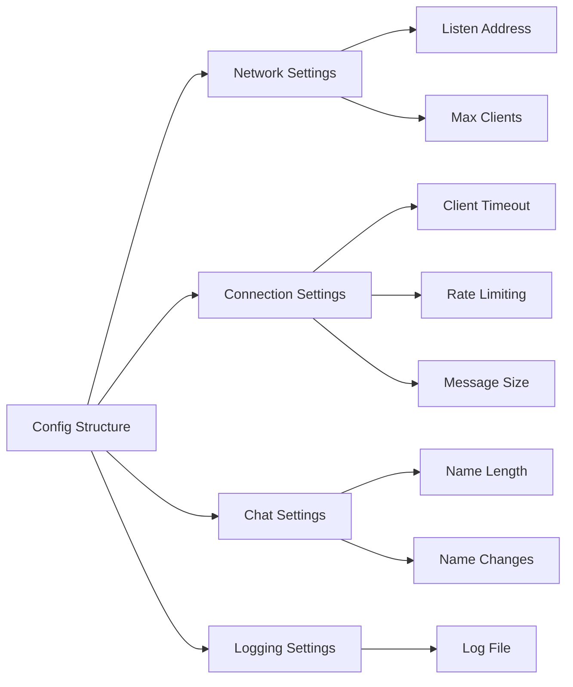

# Config Package Documentation

The config package manages server-wide configuration settings, providing a centralized way to control the TCP chat server's behavior and constraints.

## Overview



## Configuration Structure

```go
type Config struct {
    // Network settings
    ListenAddr string // Server listening address
    MaxClients int    // Maximum concurrent clients

    // Connection settings
    ClientTimeout    time.Duration // Client inactivity timeout
    MessageRateLimit time.Duration // Minimum time between messages
    MaxMessageSize   int          // Maximum message size in bytes

    // Chat settings
    MaxNameLength  int // Maximum username length
    MaxNameChanges int // Maximum allowed name changes

    // Logging settings
    LogFile string // Log file path
}
```

## Default Configuration

```go
func DefaultConfig() *Config {
    return &Config{
        ListenAddr:       ":8989",
        MaxClients:       10,
        ClientTimeout:    time.Minute * 5,
        MessageRateLimit: time.Second,
        MaxMessageSize:   1024,
        MaxNameLength:    32,
        MaxNameChanges:   3,
    }
}
```

## Configuration Methods

### Network Configuration

```go
// Set listen address
func (c *Config) WithListenAddr(addr string) *Config {
    c.ListenAddr = addr
    return c
}

// Set maximum clients
func (c *Config) WithMaxClients(max int) *Config {
    c.MaxClients = max
    return c
}
```

### Connection Configuration

```go
// Set client timeout
func (c *Config) WithClientTimeout(timeout time.Duration) *Config {
    c.ClientTimeout = timeout
    return c
}

// Set message rate limit
func (c *Config) WithMessageRateLimit(limit time.Duration) *Config {
    c.MessageRateLimit = limit
    return c
}
```

### Chat Configuration

```go
// Set maximum message size
func (c *Config) WithMaxMessageSize(size int) *Config {
    c.MaxMessageSize = size
    return c
}

// Set maximum name length
func (c *Config) WithMaxNameLength(length int) *Config {
    c.MaxNameLength = length
    return c
}
```

## Validation Rules

### Network Validation
- Listen address must be valid TCP address
- Maximum clients must be positive
- Port number must be between 1024 and 65535

### Connection Validation
- Client timeout must be >= 1 minute
- Message rate limit must be >= 100ms
- Message size must be between 1 and 4096 bytes

### Chat Validation
- Name length must be between 1 and 32 characters
- Name changes must be >= 0
- Username must not contain special characters

## Usage Examples

### Basic Configuration

```go
cfg := config.DefaultConfig().
    WithListenAddr(":2525").
    WithMaxClients(20)
```

### Custom Timeouts

```go
cfg := config.DefaultConfig().
    WithClientTimeout(10 * time.Minute).
    WithMessageRateLimit(2 * time.Second)
```

### Security Settings

```go
cfg := config.DefaultConfig().
    WithMaxMessageSize(512).        // Stricter message size
    WithMaxNameLength(16).         // Shorter usernames
    WithMaxNameChanges(1)         // Restrict name changes
```

## Environment Variables

The config package supports environment variable overrides:

| Variable | Type | Description |
|----------|------|-------------|
| CHAT_PORT | int | Server port |
| CHAT_MAX_CLIENTS | int | Maximum clients |
| CHAT_CLIENT_TIMEOUT | duration | Client timeout |
| CHAT_MESSAGE_RATE | duration | Message rate limit |
| CHAT_MAX_MESSAGE_SIZE | int | Maximum message size |
| CHAT_LOG_FILE | string | Log file path |

## Best Practices

### 1. Configuration Loading
```go
func LoadConfig() (*Config, error) {
    cfg := DefaultConfig()

    // Override from environment
    if port := os.Getenv("CHAT_PORT"); port != "" {
        cfg.WithListenAddr(":" + port)
    }

    // Validate configuration
    if err := cfg.Validate(); err != nil {
        return nil, err
    }

    return cfg, nil
}
```

### 2. Configuration Validation
```go
func (c *Config) Validate() error {
    if c.MaxClients <= 0 {
        return errors.New("max clients must be positive")
    }
    if c.ClientTimeout < time.Minute {
        return errors.New("client timeout too short")
    }
    // ... additional validation
    return nil
}
```

### 3. Safe Defaults
- Always provide reasonable default values
- Document the rationale for defaults
- Make defaults configurable when appropriate

## Configuration Files

### Example YAML Format
```yaml
network:
  listen_addr: ":8989"
  max_clients: 10

connection:
  client_timeout: 5m
  message_rate_limit: 1s
  max_message_size: 1024

chat:
  max_name_length: 32
  max_name_changes: 3

logging:
  log_file: "/var/log/chat.log"
```

## Testing

### Configuration Tests
```go
func TestConfigValidation(t *testing.T) {
    tests := []struct {
        name    string
        cfg     *Config
        wantErr bool
    }{
        {
            name: "valid config",
            cfg:  DefaultConfig(),
            wantErr: false,
        },
        {
            name: "invalid max clients",
            cfg: DefaultConfig().WithMaxClients(-1),
            wantErr: true,
        },
    }
    // ... test implementation
}
```

## Integration

### With Server Package
```go
func NewServer(cfg *Config) (*Server, error) {
    if err := cfg.Validate(); err != nil {
        return nil, fmt.Errorf("invalid config: %w", err)
    }
    return &Server{cfg: cfg}, nil
}
```

### With Client Package
```go
func NewClient(conn net.Conn, cfg *Config) *Client {
    return &Client{
        conn:     conn,
        timeout:  cfg.ClientTimeout,
        maxSize:  cfg.MaxMessageSize,
        rateLimit: cfg.MessageRateLimit,
    }
}
```

## Security Considerations

1. **Input Validation**
   - Validate all configuration values
   - Sanitize file paths
   - Check resource limits

2. **Resource Protection**
   - Set reasonable maximum values
   - Prevent resource exhaustion
   - Handle configuration errors gracefully

3. **Logging Security**
   - Validate log file permissions
   - Rotate logs appropriately
   - Handle log write failures
