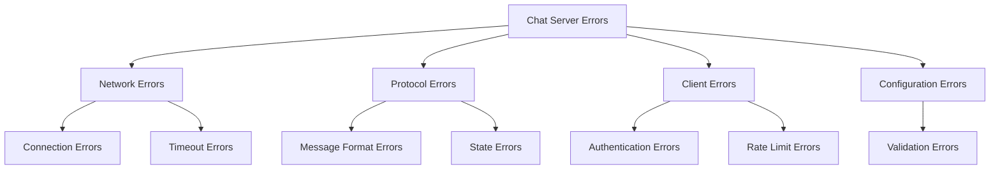

# Errors Package Documentation

The errors package provides centralized error handling and custom error types for the TCP chat server application.

## Overview



## Error Types

### Base Error Interface
```go
type ChatError interface {
    error
    Code() ErrorCode
    Severity() ErrorSeverity
}
```

### Error Categories

```go
type ErrorCode int

const (
    // Network related errors
    ErrConnectionClosed ErrorCode = iota
    ErrConnectionTimeout
    ErrMaxClientsReached

    // Protocol errors
    ErrInvalidMessageFormat
    ErrMessageTooLarge
    ErrRateLimitExceeded

    // Authentication errors
    ErrInvalidUsername
    ErrUsernameTaken
    ErrTooManyNameChanges

    // Configuration errors
    ErrInvalidConfig
    ErrInvalidPort
)
```

### Error Severity Levels

```go
type ErrorSeverity int

const (
    // Informational issues that don't affect operation
    SeverityInfo ErrorSeverity = iota

    // Minor issues that can be handled gracefully
    SeverityWarn

    // Serious issues requiring immediate attention
    SeverityError

    // Critical issues requiring shutdown
    SeverityCritical
)
```

## Error Creation

### Factory Functions

```go
// Create network error
func NewConnectionError(msg string, cause error) ChatError {
    return &networkError{
        msg:      msg,
        cause:    cause,
        code:     ErrConnectionClosed,
        severity: SeverityError,
    }
}

// Create protocol error
func NewProtocolError(msg string, code ErrorCode) ChatError {
    return &protocolError{
        msg:      msg,
        code:     code,
        severity: SeverityWarn,
    }
}

// Create authentication error
func NewAuthError(msg string, code ErrorCode) ChatError {
    return &authError{
        msg:      msg,
        code:     code,
        severity: SeverityInfo,
    }
}
```

## Error Handling

### Pattern Matching

```go
func handleError(err error) {
    switch e := err.(type) {
    case *networkError:
        handleNetworkError(e)
    case *protocolError:
        handleProtocolError(e)
    case *authError:
        handleAuthError(e)
    default:
        handleUnknownError(err)
    }
}
```

### Error Recovery

```go
func handleNetworkError(err *networkError) {
    switch err.Code() {
    case ErrConnectionClosed:
        // Clean up resources
        cleanup()
    case ErrConnectionTimeout:
        // Attempt reconnection
        reconnect()
    case ErrMaxClientsReached:
        // Reject new connections
        rejectConnection()
    }
}
```

## Best Practices

### 1. Error Creation
```go
// Good: Specific error with context
return NewProtocolError(
    fmt.Sprintf("invalid message format: %s", msg),
    ErrInvalidMessageFormat,
)

// Bad: Generic error
return errors.New("invalid message")
```

### 2. Error Handling
```go
// Good: Handle specific error conditions
if errors.Is(err, ErrConnectionClosed) {
    cleanup()
    return
}

// Bad: Generic error handling
if err != nil {
    return err
}
```

### 3. Error Propagation
```go
// Good: Wrap errors with context
if err := validateMessage(msg); err != nil {
    return fmt.Errorf("message validation failed: %w", err)
}

// Bad: Lost context
if err := validateMessage(msg); err != nil {
    return err
}
```

## Usage Examples

### Client Package Integration

```go
func (c *Client) Send(msg protocol.Message) error {
    if !c.IsActive() {
        return NewConnectionError(
            "client not active",
            ErrConnectionClosed,
        )
    }

    if len(msg.Content) > c.maxSize {
        return NewProtocolError(
            "message too large",
            ErrMessageTooLarge,
        )
    }

    return nil
}
```

### Server Package Integration

```go
func (s *Server) registerClient(c *Client) error {
    s.mu.Lock()
    defer s.mu.Unlock()

    if len(s.clients) >= s.maxClients {
        return NewConnectionError(
            "maximum clients reached",
            ErrMaxClientsReached,
        )
    }

    return nil
}
```

## Error Logging

### Structured Logging

```go
func logError(err ChatError) {
    log.Printf("[%s] %s: %v (Code: %d, Severity: %d)",
        err.Severity(),
        reflect.TypeOf(err).Elem().Name(),
        err.Error(),
        err.Code(),
        err.Severity(),
    )
}
```

### Error Metrics

```go
type ErrorMetrics struct {
    TotalErrors     int64
    NetworkErrors   int64
    ProtocolErrors  int64
    AuthErrors      int64
    ConfigErrors    int64
}
```

## Testing

### Error Creation Tests

```go
func TestNewConnectionError(t *testing.T) {
    err := NewConnectionError("test error", nil)

    if err.Code() != ErrConnectionClosed {
        t.Errorf("expected %v, got %v",
            ErrConnectionClosed,
            err.Code(),
        )
    }
}
```

### Error Handling Tests

```go
func TestErrorHandling(t *testing.T) {
    tests := []struct {
        name     string
        err      error
        wantCode ErrorCode
    }{
        {
            name: "connection closed",
            err:  NewConnectionError("closed", nil),
            wantCode: ErrConnectionClosed,
        },
        // ... more test cases
    }
    // ... test implementation
}
```

## Documentation

### Error Code Documentation

Each error code should be documented with:
- Description
- Common causes
- Recommended handling
- Example recovery steps

### Severity Level Guidelines

- **Info**: Routine issues (e.g., invalid input)
- **Warn**: Potential problems (e.g., high resource usage)
- **Error**: Serious issues (e.g., connection failures)
- **Critical**: System-threatening issues (e.g., data corruption)

## Integration Guidelines

1. **Error Creation**
   - Use factory functions
   - Include context
   - Set appropriate severity

2. **Error Handling**
   - Check specific error types
   - Handle each severity level
   - Log appropriately

3. **Error Recovery**
   - Implement recovery strategies
   - Clean up resources
   - Maintain system stability
