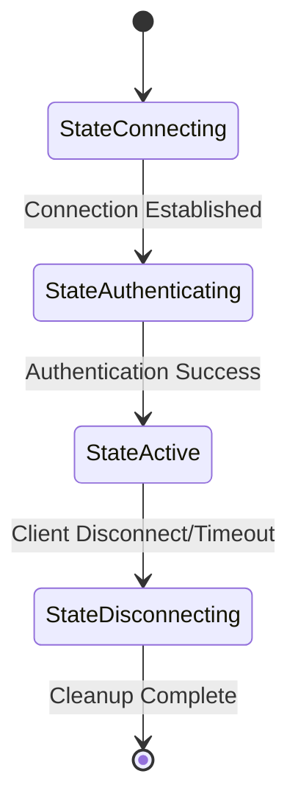

# Protocol Package Documentation

The protocol package implements the core messaging and state management functionality for the TCP chat server.

## Overview

This package defines the message format, connection states, and protocol constants used throughout the chat server implementation.

## Components

### Message Types

```go
type Message struct {
    From      string    // Sender's username or "SYSTEM"
    Content   string    // Message content
    Timestamp time.Time // Message timestamp
}
```

### Connection States

```go
type ConnectionState int

const (
    StateConnecting ConnectionState = iota
    StateAuthenticating
    StateActive
    StateDisconnecting
)
```

## Constants

```go
const (
    TimestampFormat = "2006-01-02 15:04:05" // Standard timestamp format
    MaxMessageSize  = 1024                   // Maximum message size in bytes
    MessageRateLimit = time.Second          // Minimum time between messages
)
```

## Message Flow

1. **Client Connection**
   ```
   [SYSTEM]: Welcome to TCP Chat!
   Enter your name:
   ```

2. **Authentication**
   ```
   [SYSTEM]: {username} has joined our chat...
   ```

3. **Active Chat**
   ```
   [2024-01-24 15:04:05][username]: message
   ```

4. **Disconnection**
   ```
   [SYSTEM]: {username} has left our chat...
   ```

## Message Format Specification

### Regular Messages
Format: `[TIMESTAMP][FROM]: CONTENT`

Example:
```
[2024-01-24 15:04:05][Alice]: Hello everyone!
```

### System Messages
Format: `[TIMESTAMP][SYSTEM]: CONTENT`

Example:
```
[2024-01-24 15:04:05][SYSTEM]: Bob has joined our chat...
```

## Usage Examples

### Creating Messages

```go
// Create user message
msg := protocol.NewMessage("Alice", "Hello everyone!")

// Create system message
sysMsg := protocol.SystemMessage("Server is shutting down...")
```

### Message Formatting

```go
msg := protocol.Message{
    From:      "Alice",
    Content:   "Hello",
    Timestamp: time.Now(),
}

// Convert to string format
formatted := msg.String()
// Output: [2024-01-24 15:04:05][Alice]: Hello
```

## Error Handling

The protocol package provides several error types for common scenarios:

- Invalid message format
- Message size exceeded
- Rate limit exceeded
- Invalid username format

## State Transitions



## Best Practices

1. **Message Validation**
   - Always validate message size before processing
   - Check for empty or whitespace-only content
   - Sanitize usernames and message content

2. **State Management**
   - Verify state transitions are valid
   - Handle concurrent state access safely
   - Clean up resources in disconnecting state

3. **Error Handling**
   - Gracefully handle protocol violations
   - Provide meaningful error messages
   - Log protocol-level errors for debugging

## Integration Points

The protocol package is used by:

- `client` package: For message handling and state management
- `server` package: For broadcast and connection handling
- `config` package: For protocol-related configuration

## Thread Safety

All protocol operations are designed to be thread-safe and can be safely used from multiple goroutines.

## Testing

Test coverage includes:
- Message formatting
- State transitions
- Error conditions
- Edge cases

Run protocol-specific tests:
```bash
go test -v ./internal/protocol/...
