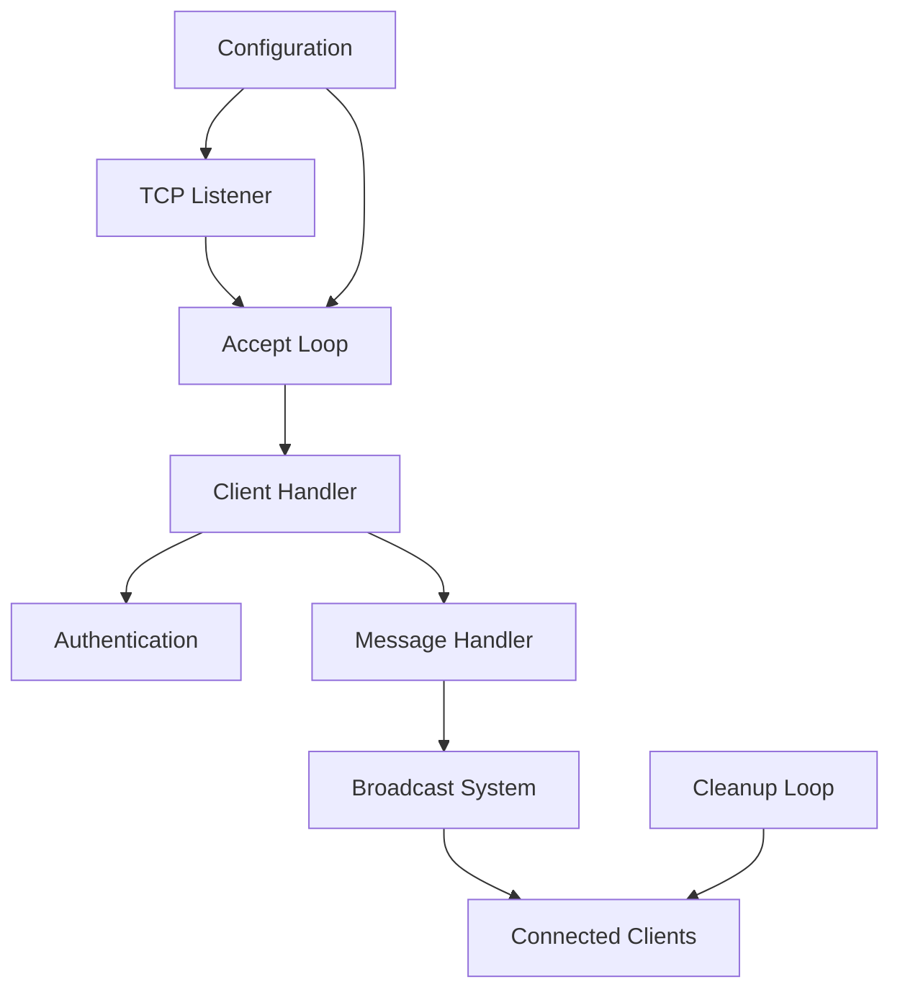

# Server Package Documentation

The server package implements the core TCP chat server functionality, managing client connections, message broadcasting, and server lifecycle.

## Architecture



## Core Components

### Server Structure

```go
type Server struct {
    cfg         *config.Config     // Server configuration
    ln          net.Listener      // TCP listener

    done        chan struct{}     // Shutdown signal
    doneMu      sync.Mutex       // Guards shutdown state
    isRunning   bool             // Server state flag

    clients     map[string]*client.Client  // Active clients
    clientsMu   sync.RWMutex              // Guards clients map

    broadcast   chan protocol.Message      // Broadcast channel
    messages    []protocol.Message         // Message history
    messagesMu  sync.RWMutex              // Guards message history

    activeNames   map[string]bool         // Active usernames
    activeNamesMu sync.RWMutex           // Guards username registry
}
```

## Server Lifecycle

### 1. Initialization
```go
func New(cfg *config.Config) *Server {
    return &Server{
        cfg:         cfg,
        done:        make(chan struct{}),
        clients:     make(map[string]*client.Client),
        broadcast:   make(chan protocol.Message, 100),
        messages:    make([]protocol.Message, 0),
        activeNames: make(map[string]bool),
    }
}
```

### 2. Starting the Server
```go
func (s *Server) Start() error {
    // Initialize listener
    listener, err := net.Listen("tcp", s.cfg.ListenAddr)
    if err != nil {
        return err
    }
    s.ln = listener

    // Start core routines
    go s.acceptLoop()
    go s.cleanInactiveConnections()
    go s.broadcastLoop()
}
```

### 3. Connection Handling
```go
func (s *Server) handleConnection(conn net.Conn) {
    c := client.New(conn)

    // Authenticate
    name, err := client.Authenticate(conn, s.cfg)
    if err != nil {
        return
    }

    // Register client
    if err := s.registerClient(c, name); err != nil {
        return
    }

    // Handle messages
    s.handleClientMessages(c)
}
```

### 4. Graceful Shutdown
```go
func (s *Server) Stop() error {
    // Signal shutdown
    close(s.done)

    // Close listener
    if err := s.ln.Close(); err != nil {
        return err
    }

    // Disconnect clients
    s.disconnectAllClients()

    return nil
}
```

## Concurrency Management

### Critical Sections
1. Client Registration
```go
func (s *Server) registerClient(c *client.Client, name string) error {
    s.clientsMu.Lock()
    defer s.clientsMu.Unlock()

    s.activeNamesMu.Lock()
    defer s.activeNamesMu.Unlock()

    if s.activeNames[name] {
        return errors.New("name already in use")
    }

    s.clients[name] = c
    s.activeNames[name] = true
    return nil
}
```

### Resource Cleanup
```go
func (s *Server) cleanInactiveConnections() {
    ticker := time.NewTicker(time.Second / 2)
    defer ticker.Stop()

    for {
        select {
        case <-s.done:
            return
        case <-ticker.C:
            s.removeInactiveClients()
        }
    }
}
```

## Message Broadcasting

### Broadcast System
```go
func (s *Server) broadcastLoop() {
    for {
        select {
        case <-s.done:
            return
        case msg := <-s.broadcast:
            s.deliverToAllClients(msg)
        }
    }
}
```

### Message History
```go
func (s *Server) storeMessage(msg protocol.Message) {
    s.messagesMu.Lock()
    defer s.messagesMu.Unlock()

    s.messages = append(s.messages, msg)
}
```

## Error Handling

### Connection Errors
- Network failures
- Listener errors
- Client disconnections

### Resource Exhaustion
- Maximum clients reached
- Channel buffer full
- Memory constraints

### Recovery Strategies
```go
func (s *Server) acceptLoop() {
    for {
        conn, err := s.ln.Accept()
        if err != nil {
            if ne, ok := err.(net.Error); ok && ne.Temporary() {
                continue // Retry on temporary errors
            }
            return // Permanent error, exit loop
        }
        go s.handleConnection(conn)
    }
}
```

## Performance Optimizations

### Connection Pooling
- Pre-allocated client map
- Buffered broadcast channel
- Efficient client lookup

### Resource Management
- Regular cleanup of inactive connections
- Message history truncation
- Goroutine lifecycle management

## Monitoring and Diagnostics

### Server Metrics
- Active connections
- Message throughput
- Error rates
- Resource utilization

### Logging
```go
func (s *Server) logServerEvent(event string, args ...interface{}) {
    log.Printf("[SERVER] "+event, args...)
}
```

## Testing

### Integration Tests
```go
func TestServerLifecycle(t *testing.T) {
    cfg := config.DefaultConfig()
    srv := New(cfg)

    if err := srv.Start(); err != nil {
        t.Fatal(err)
    }

    // Test connection handling
    // Test message broadcasting
    // Test client management

    if err := srv.Stop(); err != nil {
        t.Fatal(err)
    }
}
```

### Load Testing
- Connection limits
- Broadcast performance
- Memory usage
- Error handling

## Security Considerations

1. **Input Validation**
   - Username sanitization
   - Message size limits
   - Rate limiting

2. **Resource Protection**
   - Maximum connections
   - Timeout management
   - Buffer constraints

3. **Error Handling**
   - Graceful degradation
   - Resource cleanup
   - Panic recovery

## Integration Points

### With Client Package
- Client creation
- Authentication
- Message handling

### With Protocol Package
- Message formatting
- State management
- Error types

### With Config Package
- Server settings
- Client limits
- Timeout values
